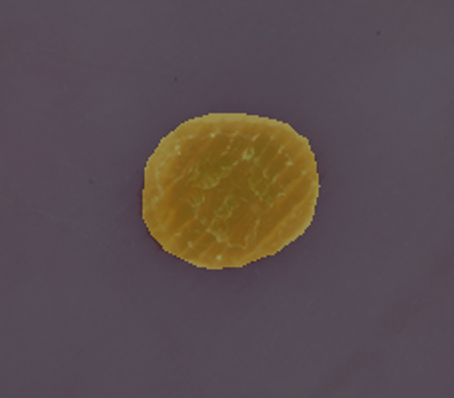

# Deep Learning for Medical Imaging WS 2020/2021 (TU Darmstadt)

## Task
Multi-class skin lesion segmentation with semantic segmentation models.

## Installation
This project was originally developed with Python 3.8, PyTorch 1.7, and CUDA 11.0. The training requires 
one NVIDIA GeForce RTX 1080 (11GB memory).

- Create conda environment:
```
conda create --name dlmi
source activate dlmi
```
- Install the dependencies:
```
pip install -r requirements.txt
```

# Setup dataset

- Download the [HAM10000](https://dataverse.harvard.edu/dataset.xhtml?persistentId=doi:10.7910/DVN/DBW86T) dataset and put the files in a directory ../dataset/raw:

- Unzip the zip files in the directory

- Run this file to setup the dataset for training, validation, and testing

    ```
    python datasets/split_dataset.py --dataset-raw PATH_TO_DATASET_RAW
    ```
   
Path required to a directory with DATASET_RAW ../dataset/raw:
  - ../dataset/raw/
    - HAM10000_images_part_1
    - HAM10000_images_part_2
    - HAM10000_segmentations_lesion_tschandl
    - HAM10000_metadata.csv

Creates a new subdirectory ../dataset/split:
  - ../dataset/split/
    - train
        - img
            - xxx.png
        - gt
            - xxx.png
        - labels.csv
    - val
        - img
            - xxx.png
        - gt
            - xxx.png
        - labels.csv
    - test
        - img
            - xxx.png
        - gt
            - xxx.png
        - labels.csv

## Run
We use [FCN](https://arxiv.org/abs/1411.4038) and [DeepLabv3](https://arxiv.org/abs/1706.05587) models with [ResNet](https://arxiv.org/abs/1512.03385) backbones pretrained on ImageNet. We fine-tune it on the given training dataset of [HAM10000](https://dataverse.harvard.edu/dataset.xhtml?persistentId=doi:10.7910/DVN/DBW86T).

To run training, please use the following command:

```
python train.py
```

For evaluation on the test set, please use the following command:
```
python eval.py
```

- ```--dataset-root```: Path to dataset folder. Default: `datset/split`
- ```--checkpoints-root```: Path to folder to save (train) and load (eval) checkpoints. Default: `checkpoints`
- ```--checkpoint-name```: File name of checkpoint in checkpoints-root for testing. Default: `None`
- ```--runs-root```: Path to output runs folder for tensorboard. Default: `runs`
- ```--num-epochs```: Number of epochs for training. Default: `100`
- ```--validation-start```: Set at which epoch to start validation during training. Default: `0`
- ```--validation-step```: Set at which epoch rate to valide during training. Default: `1`
- ```--num-classes```: Number of classes in dataset. Default: `8`
- ```--model-name```: Semantic segmentation model. Choices: `['deeplabv3_resnet50', 'fcn_resnet50']`.  Default: `fcn_resnet50`
- ```--pretrained```: Calling this means pretrained on MS COCO, not calling means only on ImageNet. Default: `False`
- ```--batch-size```: Samples per batch. Default: `12`
- ```--num-workers```: Number of workers. Default: `4`
- ```--weight-decay```: Weight decay. Default: `1e-4`
- ```--crop-size```: Creates quadratic crops for training. Default: `406`
- ```--momentum```: Momentum for SGD optimizer. Default: `0.9`
- ```--base-lr```: Learning rate at the beginning of training. Default: `1e-3`
- ```--lr-gamma```: Decay learning rate factor for poly lr scheduler. Default: `0.9`

## Example output

Input image:


Output segmentation:

